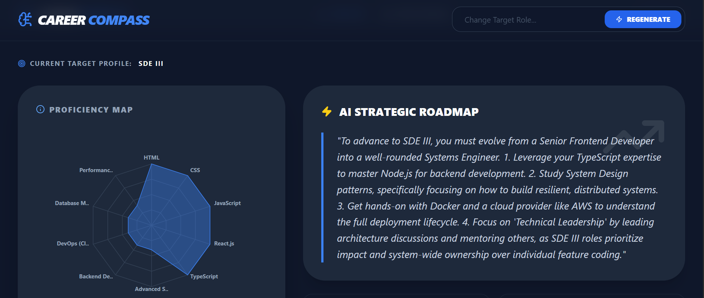
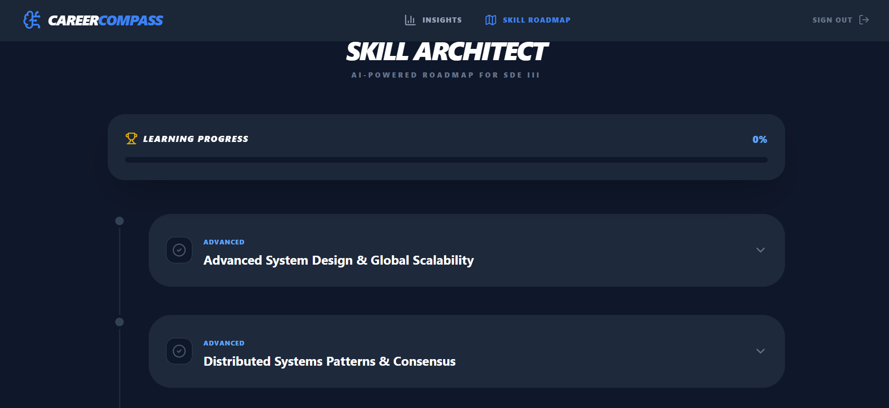

# CareerCompass | AI-Driven Skill Gap Analysis & Roadmap Engine

CareerCompass is a full-stack engineering solution designed to navigate the 2026 technical landscape. It utilizes Large Language Models (LLMs) to perform semantic gap analysis between a developer's current stack and real-time market requirements.

---

## 📌 Problem Statement
The primary challenge for modern developers isn't the lack of resources, but the **lack of direction**.
* **Skill Decay:** The half-life of technical skills is shrinking; what was industry-standard in 2024 is legacy by 2026.
* **Analysis Paralysis:** General job descriptions provide broad requirements that don't translate into structured learning paths.
* **Non-Persistent Learning:** Most roadmap tools are static; users lose milestone data across sessions, leading to fragmented learning.

## 💡 The Solution
CareerCompass acts as a persistent "Personal Engineering Manager":
1. **Delta Analysis:** Identifies the specific "delta" (gap) between a user's profile and 2026 market standards.
2. **Skill Architect:** Generates a hierarchical learning roadmap with vetted documentation and tutorials.
3. **State Synchronization:** Unlike static generators, it persists progress to a cloud database, enabling long-term goal tracking.

---

## 🏗️ System Design & Architecture Decisions


### 1. Decoupled MERN Architecture
The system is built on a decoupled architecture to ensure clear separation of concerns. The **Express.js** backend acts as a strict API gateway, while the **React** frontend manages complex UI states and asynchronous data fetching.

### 2. Semantic Gap Analysis (LLM Integration)
Instead of simple keyword matching, I utilized **Gemini 3 Flash** with specific "System Instructions" to perform semantic analysis.
* **Decision:** Used `JSON Mode` for AI responses.
* **Reasoning:** Conversational AI is unreliable for UI rendering. Forcing a schema ensures the frontend can reliably map data to Radar Charts and Roadmap nodes without parsing errors.

### 3. State Sync & Persistence Layer

* **Decision:** Implemented a dual-persistence strategy for the Skill Architect.
* **Reasoning:** The roadmap structure is saved to the `Roadmap` collection, while user-specific interactions (toggles/completions) are stored in a `Progress` array. This allows the roadmap to be "reconstructed" perfectly upon page refresh or across different devices.

### 4. Efficient Authentication Flow
* **Decision:** Integrated **Passport.js** for Google OAuth 2.0 coupled with **JWT** for session handling.
* **Reasoning:** OAuth provides a frictionless onboarding experience, while JWTs allow for stateless, secure API requests, reducing server-side session overhead.

---

## 🚀 How It Works: The Pipeline

### Phase 1: Knowledge Profiling
The user undergoes a targeted onboarding flow. This data is structured into a `CareerProfile` schema in MongoDB, acting as the "source of truth" for all subsequent AI calls.

### Phase 2: The Analysis Engine
When a user requests insights, the backend constructs a multi-turn prompt containing:
1. Current Skills
2. Target Role
3. Current Year (2026)
The engine calculates the "Skill Coverage" percentage and identifies the 5-7 most critical technologies the user is missing.

### Phase 3: Dynamic Roadmap Orchestration
The **Skill Architect** consumes the "missing skills" list. It doesn't just list them; it organizes them into a logical sequence (e.g., learning "System Design" after "Backend Fundamentals"). Each node is enriched with:
* **Difficulty Level:** Quantified based on user profile.
* **Vetted Resources:** Programmatic search for MDN/Official documentation links.

### Phase 4: Interactive Milestone Tracking
The frontend renders an interactive timeline using **Framer Motion**. Every time a user completes a milestone:
1. An optimistic UI update occurs.
2. An asynchronous `POST` request is sent to `/api/roadmap/toggle-complete`.
3. The global `Progress Bar` recalculates based on the updated DB state.

---

## 🛠️ Tech Stack
* **Frontend:** React.js, Tailwind CSS, Framer Motion, Recharts
* **Backend:** Node.js, Express.js, MongoDB/Mongoose
* **Intelligence:** Google Gemini 3 Flash API (JSON Mode)
* **Security:** JWT, Google OAuth 2.0 (Passport.js)

---

---

## 📸 Project Preview

| Feature | Visual Representation |
| :--- | :--- |
| **Interactive Dashboard** |  |
| **Skill Architect Roadmap** |  |

---

## ⚙️ Setup & Installation

### 1. Prerequisites
* Node.js (v18 or higher)
* MongoDB Atlas Account
* Google Cloud Console Project (for OAuth)
* Google AI Studio API Key (Gemini)

### 2. Installation Steps

```bash
# Clone the repository
git clone [https://github.com/piyusharora15/career-compass.git](https://github.com/piyusharora15/career-compass.git)

# Navigate to the project directory
cd career-compass

# Setup Server: Install dependencies and start
cd server
npm install
npm start

# Setup Client: In a new terminal, install dependencies and start
cd ../client
npm install
npm run dev

```

🔗 Profile & Contact:
Feel free to reach out for collaborations, technical discussions, or just to say hi!

LinkedIn: https://www.linkedin.com/in/piyush-arora1504/

GitHub: https://github.com/piyusharora15

Twitter: https://x.com/piyusharora_15
